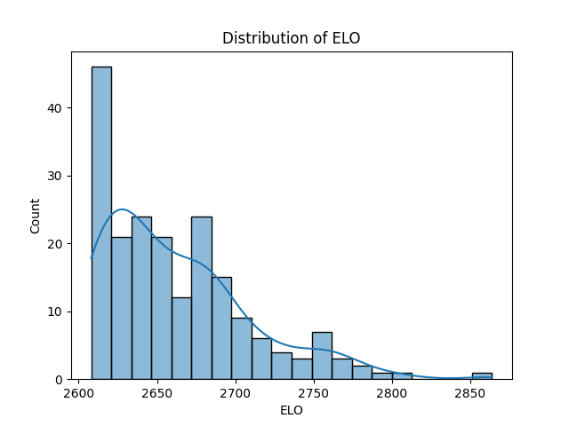
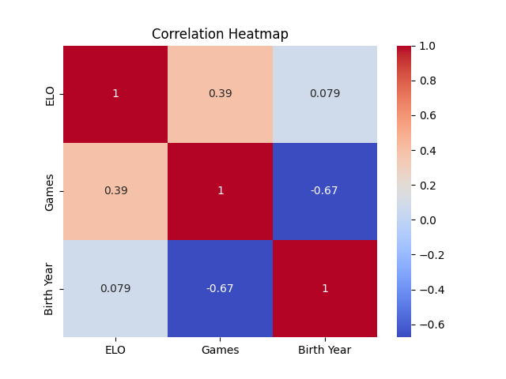

# FIDE Chess Ratings Analysis

This project aims to analyzes FIDE chess ratings for the top ranked chess players in the world. This exploring patterns in ELO scores, games played, and federations.

## Features
- Basic data cleaning in pandas.
- Visualizations of ELO, birth years and federation trends with the tools of Matplotlib and Seaborn
- Insights into top-performing players and federations.

## Skills Demonstrated
- Python (pandas, NumPy, seaborn, matplotlib)
- Data exploration and visualization

## How to Use
1. Clone this repository.
2. Place `FIDERanking.csv` in the project directory.
3. Run `chess_project.py` to generate insights and visualizations.

## Findings
- Larger federations such as the USA, Russia and India dominate the rankings.
- There is expected moderate negative correlation in the birth year of the player and the number of games played.
- There is little to no correlation to ELO (level of play) and birth year, which may seem surprising at first. However, as chess has grown there is an nicreasing number of young players competing at very high levels.
- There is an accutely moderate positive correlation to a player's ELO and the amount of games played.

## Visualizations
### Correlation Heatmap

Feel free to explore and contribute! This is my first project so I am open to any constructive criticism!
